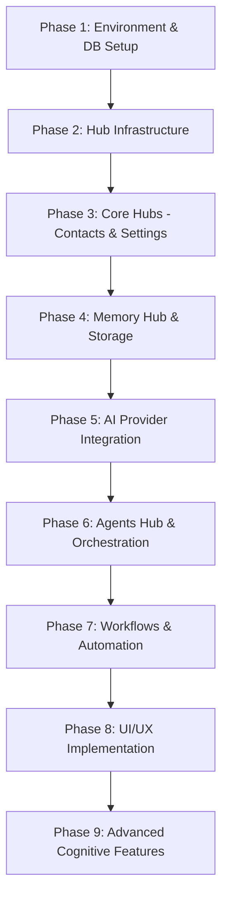

# Phase Dependencies & Critical Path

## 🏗️ The Core Hierarchy
Nexus development is structured such that infrastructure must precede intelligence. You cannot build memory without a database, and you cannot build agents without memory.

## 🗺️ Dependency Map

---

## 🔑 Critical Path Breakdown

### 1. Foundation (Phase 1-2)
- **Database Schema**: Must be fully migrated before any Hub logic is written.
- **Base Hub Classes**: All hubs inherit from a shared `BaseHub` and `HubRouter`. This must be solid to avoid massive refactoring later.

### 2. The Identity & Data Core (Phase 3-4)
- **ContactsHub**: This is the "Subject" of the system.
- **MemoryHub**: This is the "Brain". It depends on the contact structures to link memories correctly.

### 3. The Intelligence Layer (Phase 5-6)
- **AiModelsHub**: Abstracts the LLMs.
- **AgentsHub**: Uses the abstracted models to perform reasoning based on the Memory and Contacts data.

### 4. The Action Layer (Phase 7)
- **WorkflowsHub**: The "Hands". It orchestrates multiple hubs to perform complex tasks (e.g., "Summarize John's recent messages and send him a reminder").

---

## 🚦 Blockers & Risks
- **API Availability**: Delay in AI Provider keys (Gemini, OpenAI) blocks Phase 5+.
- **Database Performance**: Slow vector searches in Phase 4 will block real-time AI responses.
- **WebSocket Stability**: Real-time UI updates (Phase 8) depend on a stable Laravel Reverb setup.
