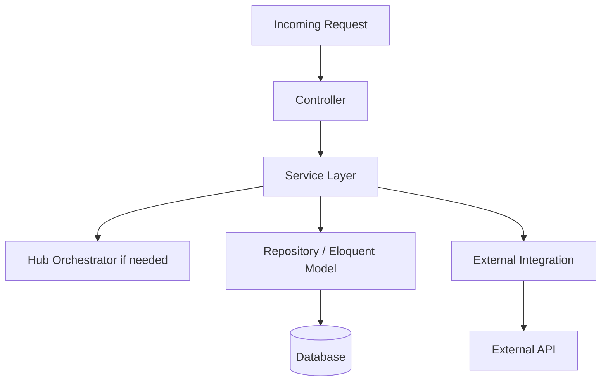

# NexusV3 — Architecture Standards

> These are the binding architectural conventions for the Nexus platform. All code must adhere to these standards.

---

## 1. Domain-Driven Hub Architecture

The application is organized into **Hubs** — self-contained domain modules that encapsulate all business logic for a specific functional area.



**Rules:**
- Each hub has its own controllers, services, and may have its own sub-models.
- **No direct cross-hub database writes.** Use Service contracts or Events.
- All controllers stay thin — business logic lives in Services.

---

## 2. Service Layer Conventions

Every Hub has at minimum one **Service class** that handles its business operations.

```php
// ✅ Correct: Business logic in Service
class ContactHubService {
    public function createContact(array $data): Contact {
        // Validation, business logic, notifications
    }
}

// ❌ Incorrect: Business logic in Controller
class ContactController {
    public function store(Request $request) {
        $contact = Contact::create($request->all()); // too thin / too fat
    }
}
```

**Service Naming:**
- `ContactHubService` — Primary service for the ContactHub
- `AgentExecutionService` — Execution-specific service
- `LogService` — Singleton-like utility service

---

## 3. Controller Conventions

```php
// ✅ Correct: Thin controller
class ContactController extends Controller {
    public function store(StoreContactRequest $request): JsonResponse {
        $contact = $this->contactService->createContact($request->validated());
        return response()->json(new ContactResource($contact), 201);
    }
}
```

- Use **Form Request classes** for validation (`app/Http/Requests/`)
- Use **API Resources** for JSON transformation (`app/Http/Resources/`)
- Return **consistent HTTP status codes**

---

## 4. Eloquent Model Conventions

```php
// Models should define:
protected $fillable = [...];           // Always explicit, never use $guarded = []
protected $casts = [...];              // Always cast JSON, booleans, datetimes
protected $attributes = [...];        // Always declare defaults
```

- **No raw queries** — Use Eloquent or Query Builder
- **Always use relationships** — Never query across hub boundaries directly
- **Scope methods** for reusable query logic (e.g., `scopeActive`, `scopeByType`)
- **Accessors** for derived attributes (e.g., `getStatusLabelAttribute`)

---

## 5. API Design Standards

```
Method  |  URL pattern                    |  Purpose
--------|----------------------------------|------------------
GET     |  /api/v1/resources              |  List (paginated)
POST    |  /api/v1/resources              |  Create
GET     |  /api/v1/resources/{id}         |  Show
PUT     |  /api/v1/resources/{id}         |  Replace
PATCH   |  /api/v1/resources/{id}         |  Partial update
DELETE  |  /api/v1/resources/{id}         |  Delete
POST    |  /api/v1/resources/{id}/action  |  Custom action
```

- **Always version APIs** — current version is `v1`
- **Use JSON** — Always set `Accept: application/json`
- **Use API Resources** — Never return raw Eloquent collections
- **Sanctum authentication** — All protected routes require `auth:sanctum`

---

## 6. Queue / Async Conventions

```php
// ✅ Correct: Heavy work in a Job
class ProcessHedraSoulMessageJob implements ShouldQueue {
    public function handle(): void {
        // AI inference, context marshaling, DB writes
    }
}

// ❌ Incorrect: Heavy work in a Controller
class HedraSoulController {
    public function send(Request $request) {
        $response = $this->llmApi->complete($request->body); // blocks!
    }
}
```

**Rules:**
- All AI inference → queue jobs
- All contact analysis → queue jobs
- All memory maintenance → queue jobs
- All email/notification sending → queue jobs

---

## 7. Error Handling Standards

```php
// ✅ Correct: Try-catch in Services
public function doSomething(): array {
    try {
        // ...
        return ['success' => true, 'data' => $result];
    } catch (\Exception $e) {
        Log::error('Failed to do something: ' . $e->getMessage());
        return ['success' => false, 'error' => 'Operation failed'];
    }
}
```

- **Never let exceptions bubble to the HTTP layer** from within Services
- **Always log** with structured context: `Log::error('...', ['contact_id' => $id])`
- **Circuit breakers** for external API calls (see `CircuitBreakerService`)
- **Dead Letter Queue** for failed jobs that exceed retry limit

---

## 8. Frontend (Blade) Standards

- **Layouts** go in `resources/views/layouts/`
- **Hub views** go in `resources/views/hubs/{hub-name}.blade.php`
- **Partials** go in `resources/views/hubs/partials/`
- **AJAX calls** use the `/api/v1/` endpoints, not direct form submissions where possible
- **No inline PHP business logic** — views only display, never compute
- **Alpine.js or vanilla JS** for interactivity (no React/Vue in the Blade layer)

---

## 9. Testing Standards

```
tests/
├── Feature/        # HTTP + integration tests (primary)
└── Unit/           # Pure unit tests for Services/Utilities
```

- **PHPUnit** (not Pest) is the test framework
- **Feature tests** are mandatory for every Controller action
- **Use factories** — Never hardcode test data
- **TDD approach** for complex business logic

---

## 10. Code Style (Pint)

Run before committing:
```bash
vendor/bin/pint --dirty --format agent
```

**PHP 8.3+ Conventions:**
- Constructor property promotion
- Named arguments where helpful
- Match expressions over switch
- Explicit return types and type hints on all methods
- PHPDoc blocks for complex parameter shapes
