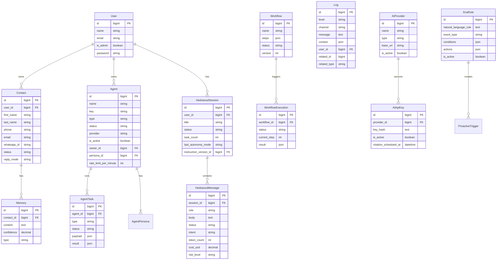

# NexusV3 — Data Models

> All models extend `BaseModel` which extends Laravel's `Eloquent\Model`. 74 migrations as of July 2026.

---

## Entity Relationship Overview



---

## Core Models

### `User`
**Table:** `users`  
**Purpose:** Application authentication and ownership.
```
Fields: id, name, email, password, email_verified_at, is_admin, created_at, updated_at
```

### `Contact`
**Table:** `contacts` (+ many extension tables)  
**Purpose:** The central CRM entity. Represents a person the user communicates with.
```
Fields: id, user_id, first_name, last_name, phone, email, whatsapp_id, waha_contact_id,
        status, reply_mode, is_favorite, profile_snapshot_id, created_at, updated_at

Relationships:
  - hasMany: ContactIdentifier, ContactAlias, ContactNote, ContactPreference
  - hasMany: ContactRelationship, ContactTag, ContactTopic, ContactMemory
  - hasMany: ContactMessage, ContactMessageThread, ContactAnalysisRun
  - hasMany: ContactReplyRule, ContactAuditEvent
  - hasOne:  ContactChannel
```

### `Agent`
**Table:** `agents`  
**Purpose:** AI Agent definition and lifecycle management.
```
Fields: id, name, key, description, type, provider, status, settings(json), metadata(json),
        is_active, last_executed_at, execution_count, success_count, error_count,
        owner_id, persona_id, is_system, rate_limit_per_minute

Types: reflection | team | autonomous | specialized | supervisor
Status: active | inactive | quarantined | idle | running | paused | error | completed

Relationships:
  - hasMany: AgentTool, AgentSkill, AgentTask, AgentRuntimeLog
  - belongsTo: AgentPersona, User (owner)
  - belongsToMany: MCPServer (via agent_mcp_servers)
```

### `AgentTask`
**Table:** `agent_tasks`  
**Purpose:** Individual task instances assigned to or run by agents.
```
Fields: id, agent_id, type, status, priority, payload(json), result(json),
        started_at, completed_at, failed_reason, retry_count, max_retries
```

### `Workflow`
**Table:** `workflows`  
**Purpose:** Reusable automation workflow definitions with versioning.
```
Fields: id, name, description, steps(json), status, version, is_active

Relationships:
  - hasMany: WorkflowExecution, WorkflowSchedule, WorkflowEventTrigger, WorkflowWebhook, WorkflowVersion
```

### `WorkflowExecution`
**Table:** `workflow_executions`  
**Purpose:** A single run instance of a Workflow.
```
Fields: id, workflow_id, status, current_step, input(json), result(json),
        started_at, completed_at, error_message

Relationships:
  - hasMany: WorkflowStepLog
  - belongsTo: Workflow
```

### `HedrasoulSession`
**Table:** `hedrasoul_sessions`  
**Purpose:** An AI conversation session with the Souly agent.
```
Fields: id, user_id, title, topic, status, task_count, approval_count,
        last_autonomy_mode, instruction_version_id, archived_at

Relationships:
  - hasMany: HedrasoulMessage, HedrasoulContextSnapshot
  - belongsTo: User, SoulyInstructionVersion
```

### `HedrasoulMessage`
**Table:** `hedrasoul_messages`  
**Purpose:** Individual messages within a Hedra Soul session.
```
Fields: id, session_id, role(user|assistant|system), body, body_format,
        status(pending|processing|completed|failed), intent, tone, sentiment,
        risk_level, token_count, cost_usd, context_snapshot_id, trace_id

Relationships:
  - belongsTo: HedrasoulSession, HedrasoulContextSnapshot, SoulyActionTrace
  - hasMany: HedrasoulMessageMention
```

### `Memory`
**Table:** `memories`  
**Purpose:** Structured memories for contacts or the system.
```
Fields: id, contact_id, content, confidence, type, source, extraction_method,
        is_indexed, extracted_at, reinforced_at

Relationships:
  - hasMany: ContactMemoryVersion
  - belongsTo: Contact
```

### `AIProvider`
**Table:** `ai_providers`  
**Purpose:** Configuration for an AI provider (OpenAI, Anthropic, Gemini, local).
```
Fields: id, name, slug, type, base_url, test_endpoint, is_active, last_synced_at

Relationships:
  - hasMany: AIApiKey, AIModel, UsageLog, AiAuditTrail
```

### `AIApiKey`
**Table:** `ai_api_keys`  
**Purpose:** Encrypted API keys for AI providers with rotation support.
```
Fields: id, provider_id, key_hash(text - encrypted), label, is_active,
        rotation_scheduled_at, last_rotated_at, last_used_at
```

### `AIModel`
**Table:** `ai_models`  
**Purpose:** Individual model configurations under a provider.
```
Fields: id, provider_id, name, slug, context_window, is_active, routing_profiles(json)
```

### `IntentRouting`
**Table:** `intent_routing`  
**Purpose:** Maps intent names to AI providers and models.
```
Fields: id, intent_name, default_provider_id, default_model_id, fallback_provider_id,
        conditions(json), priority
```

### `EcaRule`
**Table:** `eca_rules`  
**Purpose:** Event-Condition-Action rules for proactive automation.
```
Fields: id, natural_language_rule, event_type, conditions(json), actions(json), is_active

Relationships:
  - hasMany: ProactiveTrigger
```

### `ProactiveTrigger`
**Table:** `proactive_triggers`  
**Purpose:** Scheduled execution instances for ECA rules.
```
Fields: id, eca_rule_id, status(pending|completed|failed), next_run_at, context_payload(json)
```

### `Log`
**Table:** `logs`  
**Purpose:** Structured application audit log (dual-write alongside flat files).
```
Fields: id, level, channel, message, context(json), type, user_id,
        related_id, related_type(polymorphic)

Constants:
  Levels: debug|info|notice|warning|error|critical|alert|emergency
  Channels: auth|security|api|workflow|agent|ai|system|database|cache|queue
```

### `Setting`
**Table:** `settings`  
**Purpose:** Flexible key-value application configuration with encryption, categories, and multi-tenancy.
```
Fields: id, key, value, encrypted_value, is_encrypted, type, category, subcategory,
        description, is_public, workspace_id

Relationships:
  - belongsTo: Workspace
```

### `Contact Sub-Models`
| Model | Table | Purpose |
|---|---|---|
| `ContactIdentifier` | `contact_identifiers` | Phone/email/WhatsApp IDs |
| `ContactAlias` | `contact_aliases` | Alternate names |
| `ContactNote` | `contact_notes` | Free-form notes |
| `ContactPreference` | `contact_preferences` | AI-detected preferences |
| `ContactRelationship` | `contact_relationships` | Contact-to-contact links |
| `ContactTag` | `contact_tags` | Labels/tags |
| `ContactTopic` | `contact_topics` | Discussion topics |
| `ContactTopicMention` | `contact_topic_mentions` | Where topics appear |
| `ContactMessage` | `contact_messages` | Individual messages |
| `ContactMessageThread` | `contact_message_threads` | Grouped threads |
| `ContactMemory` | `contact_memories` | Memories per contact |
| `ContactAnalysisRun` | `contact_analysis_runs` | AI analysis jobs |
| `ContactAnalysisFinding` | `contact_analysis_findings` | Findings from analysis |
| `ContactAuditEvent` | `contact_audit_events` | Audit events |
| `ContactImportBatch` | `contact_import_batches` | Import job tracking |
| `ContactProfileSnapshot` | `contact_profile_snapshots` | Point-in-time snapshots |
| `ContactReplyRule` | `contact_reply_rules` | Auto-reply conditions |

### `Hedra/Souly Sub-Models`
| Model | Table | Purpose |
|---|---|---|
| `SoulyActionTrace` | `souly_action_traces` | Step-by-step AI reasoning |
| `SoulyActionPolicy` | `souly_action_policies` | Permission policies for actions |
| `SoulyInstructionVersion` | `souly_instruction_versions` | Versioned AI system prompts |
| `SoulyRuntimeProfile` | `souly_runtime_profiles` | Active runtime config |
| `HedrasoulContextSnapshot` | `hedrasoul_context_snapshots` | Context at message time |
| `HedrasoulApprovalRequest` | `hedrasoul_approval_requests` | User approval requests |
| `HedrasoulNotification` | `hedrasoul_notifications` | Agent notifications |
| `HedraProfileFact` | `hedra_profile_facts` | Hedra self-knowledge facts |
| `HedraMemorySuggestion` | `hedra_memory_suggestions` | Suggested memory updates |
| `HedraMemoryVersion` | `hedra_memory_versions` | Memory history |
| `HedraCloneSource` | `hedra_clone_sources` | Data sources for Hedra's knowledge |
