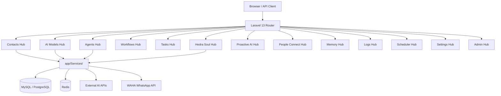

# NexusV3 — Project Overview

> **Last Updated:** 2026-07-01  
> **Framework:** Laravel 13 (upgraded from 11)  
> **PHP Version:** ^8.3  
> **Architecture:** Monolithic Laravel + Blade (Replaced Next.js frontend)

---

## 1. What is Nexus?

Nexus is a comprehensive, AI-first platform for managing contacts, automating workflows, orchestrating AI agents, and providing a "digital soul" experience through the **Hedra Soul** subsystem. It is a full-stack monolithic application where the **backend (Laravel 13)** and the **frontend (Blade templates)** are served from the same codebase.

> The project was previously structured as a decoupled system (Laravel API + Next.js frontend). It has since been **consolidated into a single Laravel monolith** using Blade views, simplifying deployment and reducing operational complexity.

---

## 2. Core Business Purpose

Nexus enables operators to:

- **Manage contacts** with rich metadata, memory, and AI-assisted intelligence.
- **Run AI agents** (Autonomous, Reflection, Team, Specialized, Supervisor) to perform background tasks.
- **Build and execute workflows** with scheduled or event-based triggers.
- **Interact with an AI "soul" (Souly/Hedra)** that can recall memories, take action, and request permissions.
- **Monitor everything** via the Logs Hub, Dashboard, and Telemetry endpoints.
- **Configure any AI provider** dynamically, without code changes, via the AI Models Hub.

---

## 3. Technology Stack

| Layer | Technology | Version |
|---|---|---|
| PHP | Laravel Framework | ^13.0 |
| Database | MySQL / PostgreSQL | — |
| Cache / Queue Broker | Redis (via Predis) | ^2.3 |
| Queue Worker | Laravel Horizon | ^5.46 |
| WebSockets | Laravel Reverb | ^1.10 |
| Authentication | Laravel Sanctum | ^4.1 |
| Frontend | Blade Templates + Vanilla CSS + TailwindCSS | — |
| Asset Bundler | Vite | — |
| Dev Tools | Telescope, Clockwork, Debugbar, Pail | — |
| Testing | PHPUnit | ^11.5 |

---

## 4. The Hub Architecture

The application is organized around the concept of **Hubs** — domain-specific modules that encapsulate all related business logic, controllers, services, and views.



---

## 5. Directory Structure Summary

```
Nexus/
├── app/
│   ├── Http/Controllers/       # All controllers (organized by hub)
│   ├── Hubs/                   # AIModelsHub orchestrator
│   ├── Integrations/           # Mem0Integration
│   ├── Models/                 # ~82 Eloquent models
│   ├── Services/               # 50+ services organized by domain
│   ├── Jobs/                   # Background queue jobs
│   ├── Events/ + Listeners/    # Event-driven architecture
│   ├── Console/Commands/       # Artisan commands
│   └── Agents/                 # Agent execution framework
├── resources/
│   └── views/
│       ├── layouts/            # Shared Blade layouts
│       └── hubs/               # Per-hub Blade views (17 views)
├── routes/
│   ├── api.php                 # 884 lines of versioned API routes (/api/v1/...)
│   ├── web.php                 # Hub web routes (/hub/...)
│   └── channels.php            # Reverb broadcast channels
├── database/
│   ├── migrations/             # 74 migrations
│   └── seeders/                # Modular seed runner system
├── Documentation/              # This folder — project docs
└── config/                     # Laravel 13 config files
```

---

## 6. Key Design Principles

1. **Domain-Driven Hub Architecture** — Each business domain is a self-contained Hub.
2. **No Cross-Hub Direct DB Writes** — Services use contracts to communicate across domains.
3. **Asynchronous-First** — Heavy tasks (AI inference, contact analysis, memory maintenance) run via Laravel Queue workers / Horizon.
4. **Observable Everything** — Dual-write logging (flat file + structured DB) via `LogService`.
5. **Dynamic AI Provider Registry** — Any AI provider (OpenAI, Anthropic, Gemini, local) can be added via the UI without code changes.

---

## 7. Current Status (as of July 2026)

| Milestone | Status |
|---|---|
| Laravel 13 Upgrade (from 11) | ✅ DONE |
| Breaking Changes Fixed | ✅ DONE |
| Test Suite Stabilization | 🔄 IN PROGRESS |
| WAHA WhatsApp Integration | ✅ Implemented |
| PeopleConnect Hub | ✅ Implemented |
| Hedra Soul Hub (50+ endpoints) | ✅ Implemented |
| Blade Frontend Migration | ✅ Completed |
