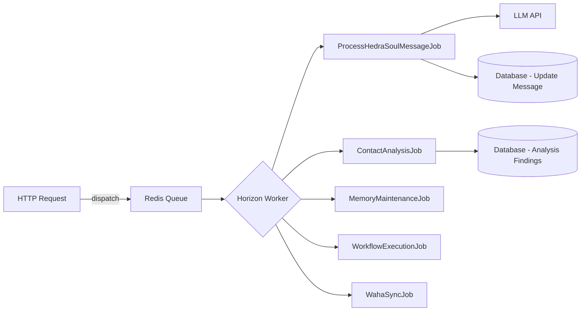
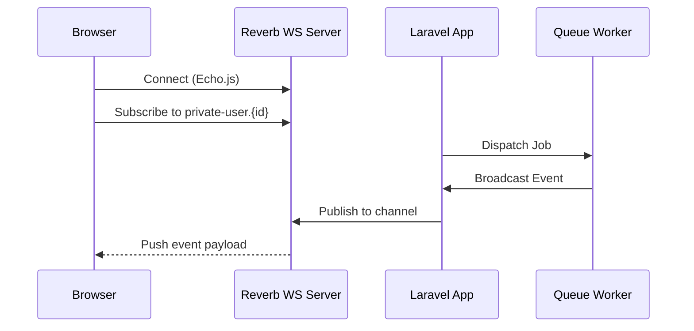
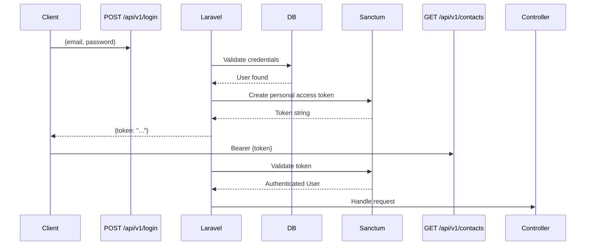

# NexusV3 — System Architecture

> **Framework:** Laravel 13 | **Frontend:** Blade | **Queue:** Horizon | **WebSockets:** Reverb

---

## 1. High-Level Architecture

```mermaid
graph TD
    subgraph Client Layer
        Browser[Browser Client]
        APIClient[External API Client / Mobile]
    end

    subgraph Laravel 13 Application
        direction TB
        Router[Router: web.php + api.php]
        
        subgraph Web Layer
            HubController[HubController - Blade Views]
            AuthController[AuthController - Sanctum]
        end

        subgraph API Layer
            ContactsAPI[Contacts API]
            AgentsAPI[Agents API]
            WorkflowsAPI[Workflows API]
            AIModelsAPI[AI Models API]
            HedraSoulAPI[HedraSoul API 50+ endpoints]
            MemoryAPI[Memory API]
            TasksAPI[Tasks API]
            SettingsAPI[Settings API]
        end

        subgraph Service Layer
            ContactHubService[ContactHubService]
            AgentExecutionService[AgentExecutionService]
            WorkflowExecutionService[WorkflowExecutionService]
            AIModelsHub[AIModelsHub Orchestrator]
            LogService[LogService]
            SettingCacheService[SettingCacheService]
        end

        subgraph Queue / Horizon
            ProcessHedraSoulMsg[ProcessHedraSoulMessageJob]
            ContactAnalysisJob[ContactAnalysisJob]
            MemoryMaintenanceJob[MemoryMaintenanceJob]
            WorkflowExecutionJob[WorkflowExecutionJob]
        end
    end

    subgraph Data Layer
        MySQL[(MySQL / PostgreSQL - 74 Migrations)]
        Redis[(Redis - Cache + Queues)]
    end

    subgraph External Services
        LLM[AI Providers - OpenAI, Anthropic, Gemini...]
        WAHA[WAHA WhatsApp Gateway]
        Mem0[Mem0 Memory API]
        MCP[MCP Servers - Tool Execution]
    end

    Browser -->|HTTP GET /hub/...| HubController
    Browser -->|AJAX /api/v1/...| API Layer
    APIClient -->|Bearer Token / Sanctum| API Layer
    Router --> Web Layer
    Router --> API Layer
    API Layer --> Service Layer
    Service Layer --> Queue / Horizon
    Service Layer --> MySQL
    Service Layer --> Redis
    Service Layer --> External Services
    Queue / Horizon --> MySQL
    Queue / Horizon --> LLM
    Queue / Horizon --> Mem0
```

---

## 2. Routing Architecture

### Web Routes (`/hub/*`)
All monolithic frontend routes are prefixed with `/hub` and served by [`HubController`](app/Http/Controllers/Web/HubController.php). The controller fetches data and passes it to Blade views.

| Route | View | Purpose |
|---|---|---|
| `GET /hub/dashboard` | `dashboard.blade.php` | Main dashboard |
| `GET /hub/contacts` | `contacts.blade.php` | CRM list |
| `GET /hub/contacts/{id}` | `contact-profile.blade.php` | Contact detail |
| `GET /hub/agents` | `agents.blade.php` | AI Agents |
| `GET /hub/workflows` | `workflows.blade.php` | Workflows |
| `GET /hub/memory` | `memory.blade.php` | Memory Hub |
| `GET /hub/logs` | `logs.blade.php` | Logs console |
| `GET /hub/models` | `models.blade.php` | AI Models |
| `GET /hub/hedra-soul` | `hedra-soul.blade.php` | Hedra Soul AI |
| `GET /hub/proactive-ai` | `proactive-ai.blade.php` | Proactive AI rules |
| `GET /hub/tasks` | `tasks.blade.php` | Task manager |
| `GET /hub/scheduler` | `scheduler.blade.php` | Scheduler |
| `GET /hub/people-connect` | `people-connect.blade.php` | Messaging |
| `GET /hub/waha` | `waha.blade.php` | WhatsApp mgmt |
| `GET /hub/settings` | `settings.blade.php` | Settings |
| `GET /hub/admin` | `admin.blade.php` | Admin panel |
| `GET /hub/apis` | `apis.blade.php` | API Keys |

### API Routes (`/api/v1/*`)
Protected by `auth:sanctum` middleware. All routes use JSON responses with consistent envelope structure.

---

## 3. Queue Architecture



**Horizon Queues Used:**
- `default` — General purpose jobs
- `ai` — AI inference jobs (higher priority, separate workers)
- `contacts` — Contact analysis and memory maintenance
- `workflows` — Workflow step execution

---

## 4. WebSocket Architecture (Reverb)



**Broadcast Channels (from `channels.php`):**
- `private-user.{id}` — User-specific events
- `private-hedrasoul.{session}` — AI session messages
- `presence-workspace.{id}` — Multi-user workspaces

---

## 5. Authentication Flow



---

## 6. Data Storage Strategy

| Data Type | Storage | Rationale |
|---|---|---|
| Entities (Contacts, Agents, etc.) | MySQL | Relational integrity, ACID |
| Session / Cache | Redis | Speed, TTL management |
| Queue Jobs | Redis (via Horizon) | Real-time queue management |
| AI Context Snapshots | MySQL (JSON column) | Arbitrary schema, portability |
| Structured Memories | MySQL | Versioned, queryable |
| File Logs | `storage/logs/` | Laravel native, dev-friendly |
| Structured Logs | MySQL `logs` table | Queryable, audit trail |
| API Keys | MySQL (encrypted) | `EncryptedApiKeyStorage` service |

---

## 7. Infrastructure Services

| Service | Purpose | Config |
|---|---|---|
| **Laravel Horizon** | Queue monitoring + worker management | `config/horizon.php` |
| **Laravel Reverb** | WebSocket server | `config/reverb.php` |
| **Laravel Sanctum** | API token authentication | `config/sanctum.php` |
| **Laravel Telescope** | Debug & observability (dev) | `config/telescope.php` |
| **Clockwork / Debugbar** | Request profiling (dev) | Auto-discovered |
