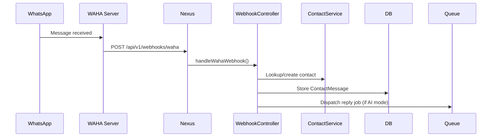

# NexusV3 — Third Party Integrations

> Comprehensive list of all external services integrated with the Nexus platform.

---

## 1. AI Providers (via AIModelsHub)

The Nexus AI Models Hub uses a **dynamic provider registry** pattern. New AI providers can be added via the UI without code changes. All providers must implement the `AiProviderInterface`.

### Currently Supported Providers
| Provider | Type | Base URL Pattern | Notes |
|---|---|---|---|
| OpenAI | cloud | `https://api.openai.com/v1` | GPT-4o, GPT-4-turbo, GPT-3.5 |
| Anthropic | cloud | `https://api.anthropic.com/v1` | Claude 3.5, Claude 3 Opus |
| Google Gemini | cloud | `https://generativelanguage.googleapis.com/v1beta` | Gemini 1.5 Pro/Flash |
| OpenRouter | aggregator | `https://openrouter.ai/api/v1` | Access 200+ models |
| Groq | cloud | `https://api.groq.com/openai/v1` | Fast LLaMA inference |
| Local / Ollama | local | `http://localhost:11434/v1` | Fully offline models |

**Configuration:** Managed via `AiProvider` model + `AIApiKey` model with AES-256 encryption.

**Circuit Breaker:** Each provider has a circuit breaker (`CircuitBreakerService`) that automatically disables a provider after consecutive failures and re-enables after a cooldown.

---

## 2. WAHA — WhatsApp HTTP API

**Purpose:** Enables real-time WhatsApp message receiving and sending for the People Connect Hub.

| Property | Value |
|---|---|
| Official Site | https://waha.devlike.pro |
| Integration Type | HTTP REST API (self-hosted) |
| Webhook Direction | WAHA → Nexus (inbound) |
| Inbound Endpoint | `POST /api/v1/webhooks/waha` |
| Controller | `WebhookController::handleWahaWebhook()` |
| Sync Model | `WahaSyncProcess` model tracks sync jobs |

**Configuration (`.env`):**
```env
WAHA_BASE_URL=http://your-waha-server:3000
WAHA_API_KEY=your-waha-key
WAHA_SESSION=default
```

**Data Flow:**


---

## 3. Mem0 — AI Memory API

**Purpose:** External semantic memory storage for AI context. Provides persistent, queryable episodic memory for AI agents.

| Property | Value |
|---|---|
| Official Site | https://mem0.ai |
| Integration Class | `App\Integrations\Mem0Integration` |
| Integration Type | HTTP REST API |
| Status | Stub implemented (store, search, delete methods present — needs real API wiring) |

**Configuration (`.env`):**
```env
MEM0_API_KEY=your-mem0-key
MEM0_BASE_URL=https://api.mem0.ai
```

**Note:** The current `Mem0Integration.php` is a stub — methods return `true` and empty arrays. The real Mem0 HTTP client needs to be wired in.

---

## 4. MCP Servers — Model Context Protocol

**Purpose:** Connects AI agents to external tools and data sources via the Model Context Protocol (MCP). Each MCP server exposes a set of tools that agents can call.

| Property | Value |
|---|---|
| Protocol | MCP (open standard) |
| Model | `MCPServer` |
| Service | `MCPIntegrationService` |
| Management UI | `mcp-servers` API resource |

**Examples of MCP Servers:**
- Database query tools
- File system access
- Browser/web search
- Code execution sandbox
- Custom API connectors

**Agent↔MCP Association:** Via the `agent_mcp_servers` pivot table (many-to-many).

---

## 5. Laravel Reverb — WebSocket Server

**Purpose:** Self-hosted WebSocket server for real-time bi-directional communication between the Laravel backend and Blade frontend.

| Property | Value |
|---|---|
| Package | `laravel/reverb ^1.10` |
| Protocol | WebSocket |
| Client Library | Laravel Echo (frontend) |
| Config File | `config/reverb.php` |
| Default Port | 8080 |

**Configuration (`.env`):**
```env
REVERB_APP_ID=nexus-app-id
REVERB_APP_KEY=reverb-key
REVERB_APP_SECRET=reverb-secret
REVERB_HOST=localhost
REVERB_PORT=8080
REVERB_SCHEME=http
```

---

## 6. Laravel Horizon — Queue Dashboard

**Purpose:** Queue worker management, real-time monitoring, and job failure tracking for Redis-backed queues.

| Property | Value |
|---|---|
| Package | `laravel/horizon ^5.46` |
| Dashboard URL | `/horizon` |
| Config File | `config/horizon.php` |
| Queue Driver | Redis (required) |

---

## 7. Laravel Sanctum — API Authentication

**Purpose:** Lightweight API token authentication using personal access tokens.

| Property | Value |
|---|---|
| Package | `laravel/sanctum ^4.1` |
| Token Type | Personal Access Token (PAT) |
| Header | `Authorization: Bearer {token}` |
| Config File | `config/sanctum.php` |

---

## 8. Laravel Telescope (Dev Only)

**Purpose:** Debug panel for inspecting requests, queries, jobs, cache, logs, events, and more during development.

| Property | Value |
|---|---|
| Package | `laravel/telescope ^5.20` |
| Dashboard URL | `/telescope` |
| Environment | `local` only |

---

## 9. Clockwork + Debugbar (Dev Only)

**Purpose:** Request profiling, N+1 query detection, query timeline visualization.

| Property | Value |
|---|---|
| Packages | `itsgoingd/clockwork ^5.3`, `barryvdh/laravel-debugbar ^4.3` |
| Clockwork URL | `/_clockwork` |
| Environment | `local` only |

---

## 10. opcodesio/log-viewer

**Purpose:** Web-based log viewer with search, filtering, and pagination for Laravel log files.

| Property | Value |
|---|---|
| Package | `opcodesio/log-viewer ^3.24` |
| Dashboard URL | `/log-viewer` |

---

## 11. Pusher PHP SDK

**Purpose:** Used as the broadcasting driver interface (even when using Reverb, the Pusher protocol is maintained for compatibility).

| Property | Value |
|---|---|
| Package | `pusher/pusher-php-server ^7.2` |
| Config | `BROADCAST_CONNECTION=reverb` |
