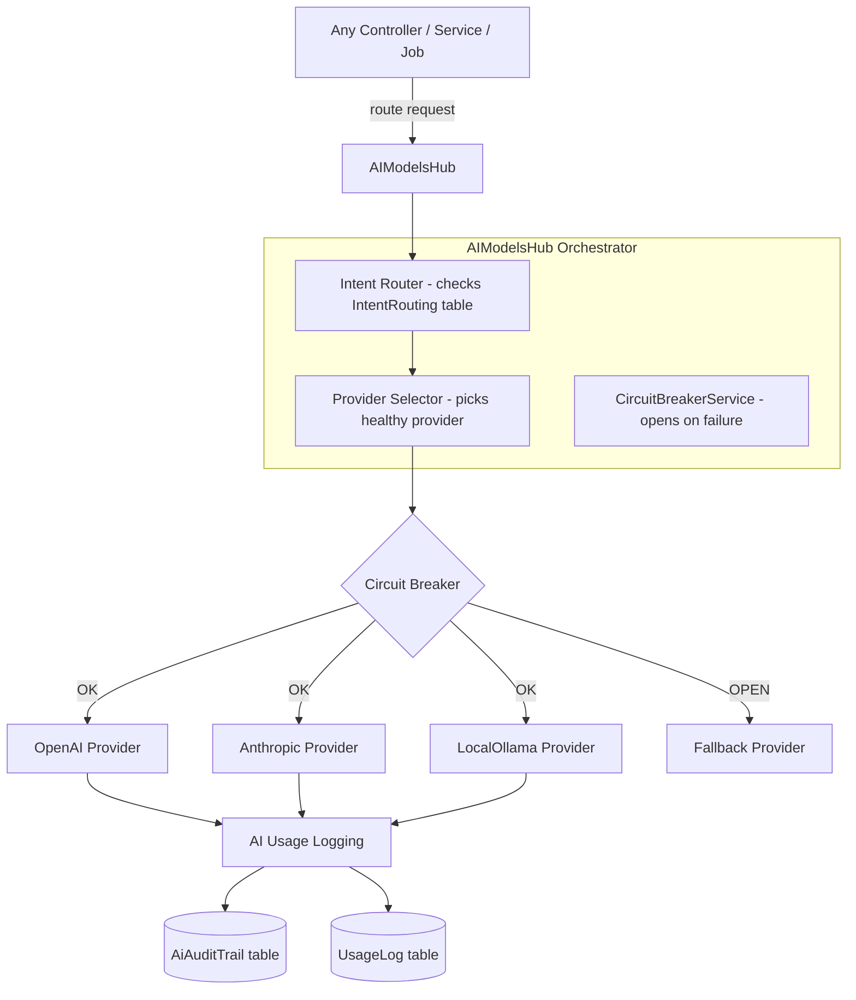
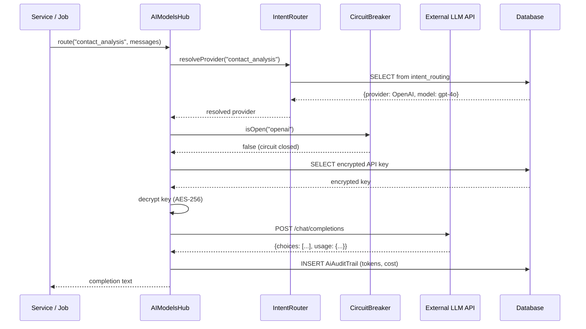

# AI Models Hub — Architecture

## 1. Overview

The AI Models Hub is the **central intelligence router** for all AI requests within Nexus. It dynamically routes AI requests to the correct provider and model based on intent, manages encrypted API keys, tracks usage and cost, and provides a circuit breaker for reliability.

---

## 2. Architecture Diagram



---

## 3. Component Breakdown

### `AIModelsHub` (App\Hubs\AIModelsHub)
The main orchestrator. Key methods:
- `route(string $intent, array $messages, array $options): array`
  - Looks up `IntentRouting` to find the correct provider/model
  - Calls `CircuitBreakerService` to check provider health
  - Delegates to the correct provider adapter
  - Logs usage to `AiAuditTrail`
  - Returns the raw completion response

### `AiRouteController` (16KB)
Handles routing-layer API calls:
- `route()` — Execute a routed AI request
- `providerHealth()` — Real-time health dashboard for all providers
- `auditTrail()` — Paginated AI audit trail
- `telemetry()` — Aggregated usage telemetry

### `AiProviderController` (15KB)
CRUD for AI providers:
- `store()` — Register new provider with encrypted key
- `test()` — Validate connectivity by sending a test prompt
- `syncModels()` — Fetch available models from provider API and save to `AIModel`
- `toggleActive()` — Enable/disable provider

### `AiRequestController` (20KB)
Business-logic layer for AI requests:
- `handleRequest()` — Central gateway for all AI completion requests
- `getRoutingMatrix()` — View the full intent→provider mapping
- `routeIntent()` — Update intent routing rules

### `CircuitBreakerService` (2.7KB)
Redis-backed circuit breaker. Opens circuit after N consecutive failures, auto-resets after configurable timeout.

---

## 4. Provider Architecture

Each AI provider is registered as a configuration record in the `ai_providers` table. The system uses a **Universal Adapter** pattern via `DynamicRestProvider` — a single PHP class that makes requests to any OpenAI-compatible API by reading the `base_url` from the database.

```php
// Conceptual flow inside the Hub
$provider = AIProvider::where('slug', $resolvedSlug)->first();
$key = $this->decryptKey($provider->apiKeys()->active()->first());
$response = Http::withToken($key)
    ->post($provider->base_url . '/chat/completions', $payload);
```

---

## 5. Intent Routing System

```mermaid
graph LR
    Request[AI Request with intent: "contact_analysis"] -->|lookup| IR[(IntentRouting table)]
    IR -->|found| Provider[Assigned Provider + Model]
    IR -->|not found| DefaultProvider[Default Provider from settings]
    Provider --> Conditions{Conditions check}
    Conditions -->|pass| Execute[Execute request]
    Conditions -->|fail| Fallback[Fallback Provider]
```

**IntentRouting record:**
```json
{
  "intent_name": "contact_analysis",
  "default_provider_id": 1,
  "default_model_id": 3,
  "fallback_provider_id": 2,
  "conditions": { "min_context_tokens": 0, "max_cost_usd": 0.05 },
  "priority": 10
}
```

---

## 6. Key Models

### `AIProvider`
```
Fields: id, name, slug, type, base_url, test_endpoint, is_active, last_synced_at
Relationships: hasMany AIApiKey, AIModel, UsageLog, AiAuditTrail
```

### `AIApiKey`
```
Fields: id, provider_id, key_hash (AES-256 encrypted), label, is_active,
        rotation_scheduled_at, last_rotated_at, last_used_at
```

### `AIModel`
```
Fields: id, provider_id, name, slug, context_window, is_active, routing_profiles(json)
```

### `IntentRouting`
```
Fields: id, intent_name, default_provider_id, default_model_id, fallback_provider_id,
        conditions(json), priority
```

### `AiAuditTrail`
```
Fields: id, provider_id, model_id, intent, input_tokens, output_tokens,
        cost_usd, duration_ms, status, user_id, request_payload(json), created_at
```

---

## 7. Data Flow: Making an AI Request


