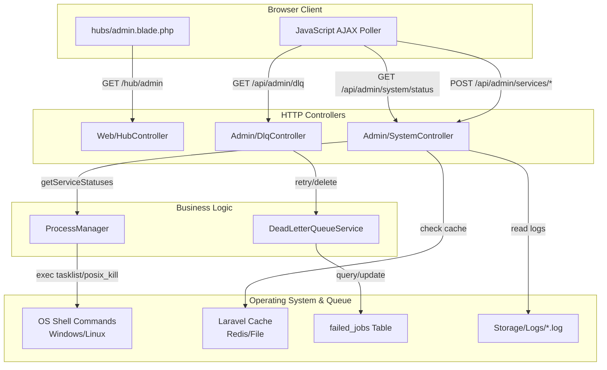

# Admin Hub Architecture

## Overview
The Admin Hub follows a clean Model-View-Controller (MVC) architecture, heavily leveraging Laravel's Service container for business logic separation. It bridges the gap between web HTTP requests and underlying operating system processes.

## Component Breakdown

### 1. Controllers
- **`HubController@admin`**: Serves as the primary entry point for the frontend UI. It simply returns the `hubs.admin` Blade view. The actual data hydration happens via subsequent asynchronous API calls.
- **`SystemController`**: The core API controller for system health.
  - Generates metrics using native PHP functions (`memory_get_usage`, `disk_free_space`) and OS commands.
  - Implements a caching layer (`admin:system:status`) to prevent repeated expensive OS calls.
  - Dispatches build commands to background OS processes (using PowerShell on Windows or Bash on Linux).
- **`DlqController`**: Manages the Dead Letter Queue.
  - Interfaces with the `DeadLetterQueueService` to fetch, retry, or delete failed jobs from the Laravel queue system.

### 2. Services
- **`ProcessManager`**: Abstracts the OS-specific logic required to check if a process (PID) is running, and to start/stop services (like API, Vite, Next.js, Reverb).
- **`DeadLetterQueueService`**: Encapsulates the logic for interacting with Laravel's `failed_jobs` table and queue worker facade.

### 3. Views
- **`admin.blade.php`**: A heavy, interactive Blade template that uses Bootstrap 5, custom CSS (`.system-card`, `.terminal-box`), and vanilla JavaScript/jQuery to poll the backend and update the DOM dynamically without page reloads.

## System Architecture Diagram



## OS Compatibility Layer
A key architectural decision in `SystemController` is the explicit branching for OS compatibility. 
When checking server uptime or triggering builds, the system checks `PHP_OS`.
- **Windows**: Uses `wmic`, `tasklist`, and `powershell -ExecutionPolicy Bypass`.
- **Unix/Linux**: Uses `uptime`, `posix_kill`, and `bash`.

## Performance Considerations
Because calculating disk space, memory, and executing shell commands blocks the PHP thread, the `SystemController@status` endpoint uses Laravel Cache:
```php
if (Cache::has($cacheKey)) {
    return response()->json(Cache::get($cacheKey));
}
// Generate fresh data...
Cache::put($cacheKey, $data, 30);
```
This ensures that even if the UI auto-refreshes every 5 seconds, the server only performs the heavy lifting every 30 seconds.
