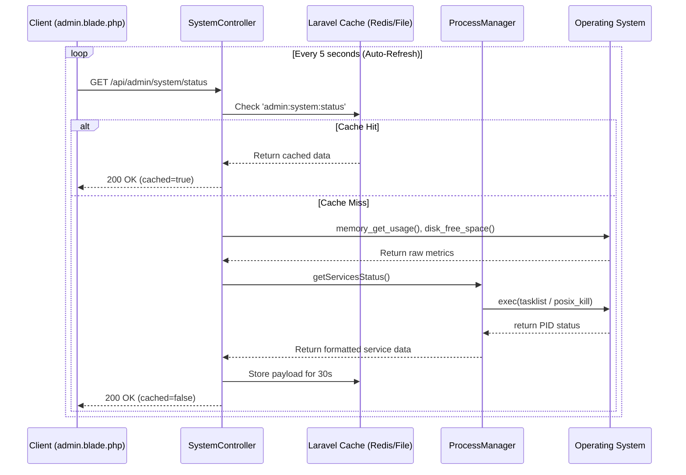
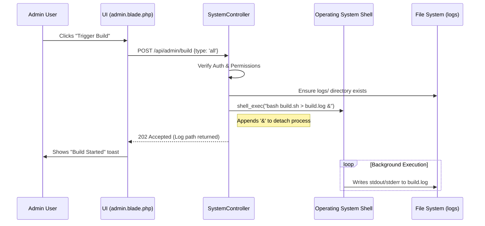
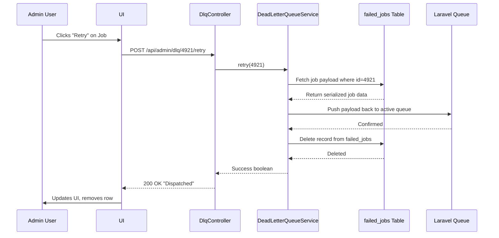

# Admin Hub Data Flow

## 1. Overview
Data flow in the Admin Hub is primarily read-heavy (polling system metrics) with occasional write-heavy administrative commands (restarting services, retrying jobs). The flow is strictly unidirectional from the Controller down to the OS layer, with caching implemented at the Controller layer to protect the OS.

## 2. System Status Polling Data Flow

This diagram illustrates how the frontend retrieves the system metrics every 5 seconds without crashing the server.

## 3. Background Build Execution Flow

When an administrator clicks "Trigger Build", the process must be offloaded to the background so the HTTP request doesn't timeout.

## 4. Dead Letter Queue Data Flow

The flow for retrying a failed job involves the DLQ Controller and Laravel's Queue worker.

