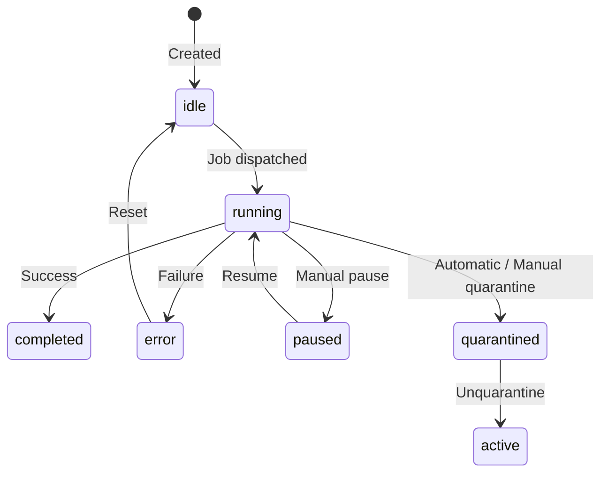
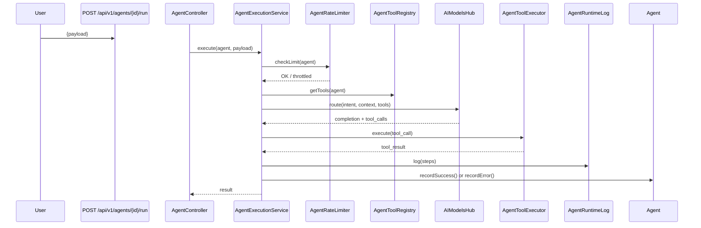
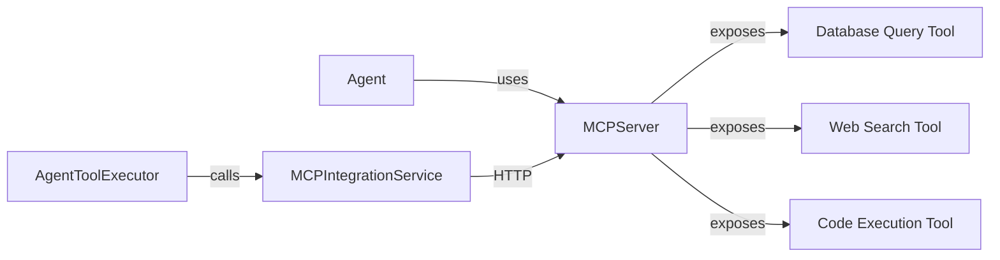

# Agents Hub — Architecture

## 1. System Architecture Overview

The Agents Hub provides a multi-agent orchestration framework. Agents are configurable AI actors that can be assigned tasks, given tools and skills, connected to MCP servers, and monitored in real time.

```mermaid
graph TD
    subgraph HTTP Layer
        AC[AgentController]
        AAPC[AgentPersonaController]
        ATLC[AgentToolLibraryController]
        MCPC[MCPServerController]
    end

    subgraph Service Layer
        AES[AgentExecutionService]
        ALS[AgentLifecycleService]
        AQS[AgentQuarantineService]
        APS[AgentPersonaService]
        ASS[AgentSimulationService]
        ASKS[AgentSkillLibrary]
        ATR[AgentToolRegistry]
        ATE[AgentToolExecutor]
        ARLS[AgentRateLimiter]
        AREG[AgentRegistry]
    end

    subgraph Data Layer
        Agent[(Agent model)]
        AgentTask[(AgentTask)]
        AgentTool[(AgentTool)]
        AgentSkill[(AgentSkill)]
        AgentPersona[(AgentPersona)]
        MCPServer[(MCPServer)]
        AgentRuntimeLog[(AgentRuntimeLog)]
    end

    HTTP Layer --> Service Layer
    Service Layer --> Data Layer
    Service Layer --> MCPIntegrationService
    Service Layer --> AIModelsHub
```

---

## 2. Agent Types & Behaviors

| Type | Constant | Behavior |
|---|---|---|
| `reflection` | `TYPE_REFLECTION` | Analyzes its own output and refines it iteratively |
| `team` | `TYPE_TEAM` | Coordinates multiple sub-agents |
| `autonomous` | `TYPE_AUTONOMOUS` | Executes multi-step tasks independently |
| `specialized` | `TYPE_SPECIALIZED` | Domain-expert agent (e.g., "Marketing Agent") |
| `supervisor` | `TYPE_SUPERVISOR` | Monitors other agents, can quarantine them |

---

## 3. Agent Status Lifecycle



---

## 4. Agent Execution Flow



---

## 5. Service Layer Details

### `AgentExecutionService` (7.5KB)
Core execution engine. Handles the full agent request→response cycle including tool dispatch and result logging.

### `AgentLifecycleService` (6.5KB)
Manages agent start/stop/restart operations. Interacts with the process manager.

### `AgentQuarantineService` (2.4KB)
Handles quarantine and unquarantine logic. Quarantine prevents an agent from accepting new tasks.

### `AgentSimulationService` (4.8KB)
Dry-run mode that executes the full agent flow but does not persist side effects.

### `AgentToolExecutor` (4.2KB)
Dispatches tool calls either to:
- Local tool implementations (in `app/Services/Engines/`)
- MCP servers (via `MCPIntegrationService`)

### `AgentPersonaService` (2.3KB)
Loads the agent's persona (system prompt, tone, role description) to inject into AI requests.

### `AgentRateLimiter` (1.7KB)
Per-agent rate limiting using Redis sliding window. Default: 60 requests/minute.

---

## 6. MCP Integration



MCP servers are registered via the API (`POST /api/v1/mcp-servers`) and associated with agents via the `agent_mcp_servers` pivot table.

---

## 7. Key Models

### `Agent`
```
Fields: id, name, key, description, type, provider, status, settings(json),
        metadata(json), is_active, last_executed_at, execution_count,
        success_count, error_count, owner_id, persona_id, is_system,
        rate_limit_per_minute

Methods:
  - getSuccessRate(): float
  - incrementExecution(): void
  - recordSuccess(): void
  - recordError(): void
  - quarantine(): void
  - unquarantine(): void
  - activeTools(): Collection
  - activeSkills(): Collection
  - isRunning(): bool / isIdle(): bool / isQuarantined(): bool
```

### `AgentTool`
A tool registered on an agent — maps to either a local PHP implementation or an MCP server endpoint.
```
Fields: id, agent_id, name, type, config(json), is_active
```

### `AgentPersona`
The AI personality layer injected into every agent request as the system prompt.
```
Fields: id, name, role, tone, system_prompt, user_id
```
