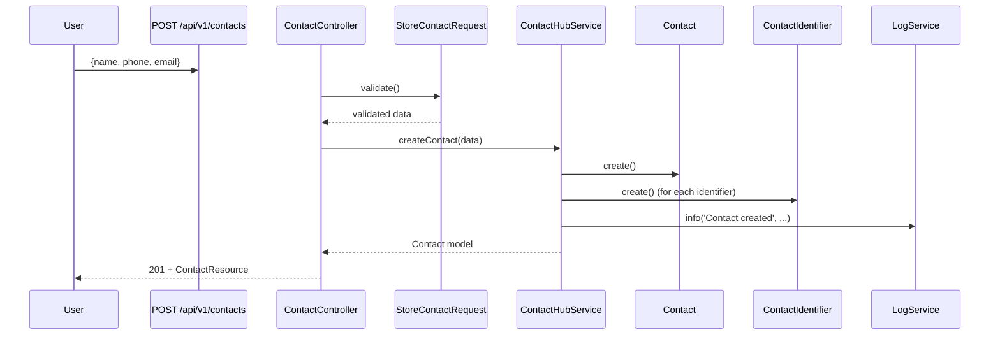
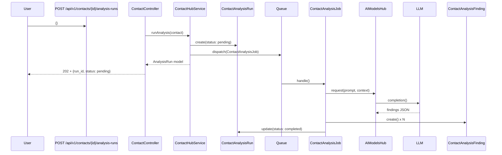

# Contacts Hub — Architecture

## 1. System Architecture

The Contacts Hub follows a layered architecture with a clear separation between the HTTP layer, business logic layer, and data layer.

```mermaid
graph TD
    subgraph HTTP Layer
        CC[ContactController 42KB]
        CSC[ContactStatsController]
        CIC[ContactImportController]
        CNC[ContactNoteController]
        CPC[ContactPreferenceController]
        CRC[ContactRelationshipController]
        CAC[ContactAliasController]
        CIDC[ContactIdentifierController]
    end

    subgraph Service Layer
        CHS[ContactHubService 15KB]
        CAS[ContactAnalyticsService]
        CAUDS[ContactAuditService]
        CIDS[ContactIdentityResolver]
        CPS[ContactPrivacyService]
        CPAS[ContactProfileAssembler]
        CRS[ContactReplyModeService]
        CSS[ContactStatsService]
    end

    subgraph Data Layer
        Contact[(Contact model)]
        ContactMsg[(ContactMessage)]
        ContactMem[(ContactMemory)]
        ContactAnalysis[(ContactAnalysisRun)]
        ContactImport[(ContactImportBatch)]
    end

    HTTP Layer --> Service Layer
    Service Layer --> Data Layer
    Data Layer --> MySQL[(MySQL)]
```

---

## 2. Controller Breakdown

### `ContactController` (42KB — largest controller)
The primary controller for all contact operations. Handles:
- Standard CRUD
- Complex sub-resource retrieval (messages, threads, memory, intelligence, analytics, timeline, persona, emotional baseline, talk specs, topics)
- Analysis runs (create, list, show, apply, rollback)
- Memory maintenance operations
- Merge, enrich, erase, export

### `ContactImportController`
Handles bulk import flows:
- `preview()` — parse CSV and return a preview without saving
- `importWhatsApp()`, `importWaha()`, `importFacebook()` — source-specific importers
- `listBatches()`, `showBatch()` — track import jobs
- `rollbackBatch()` — undo an import

### `ContactStatsController`
Aggregated statistics and reply mode management:
- `stats()` — contact counts by status, active contacts, import stats
- `getGlobalReplyMode()` / `setGlobalReplyMode()` — system-wide AI reply toggle
- `getContactReplyMode()` / `setContactReplyMode()` — per-contact override

---

## 3. Service Layer Breakdown

### `ContactHubService` (15KB)
The main orchestrator. Responsibilities:
- `createContact()` — validates, creates, triggers welcome workflow if configured
- `updateContact()` — validates, updates, fires `ContactUpdated` event
- `assembleContactProfile()` — delegates to `ContactProfileAssembler`
- `runAnalysis()` — dispatches `ContactAnalysisJob` to queue
- `extractMemories()` — dispatches memory extraction job

### `ContactProfileAssembler`
Aggregates all sub-entities into a unified profile view:
- Fetches identifiers, aliases, notes, preferences, relationships, memories
- Builds the `profile_snapshot` JSON payload
- Caches the assembled snapshot for performance

### `ContactAnalyticsService`
Computes analytics per contact:
- Message volume over time
- Topic distribution
- Sentiment trends
- Response time analysis

### `ContactPrivacyService`
Handles GDPR operations:
- `eraseContact()` — fires deletion events and hard-deletes all data
- Generates audit events for every deletion action

### `ContactReplyModeService`
Manages the reply mode hierarchy:
1. Per-contact override (highest priority)
2. Per-channel mode
3. Global mode (lowest priority)

---

## 4. Key Data Flows

### Creating a Contact


### Running an AI Analysis

