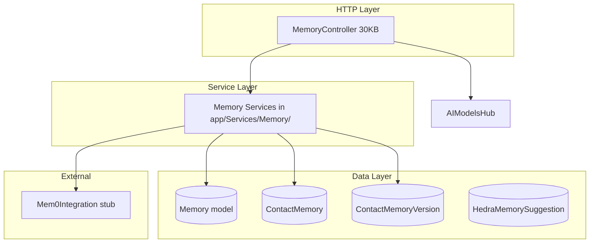
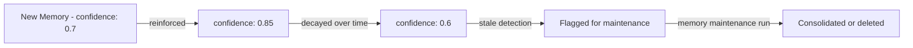
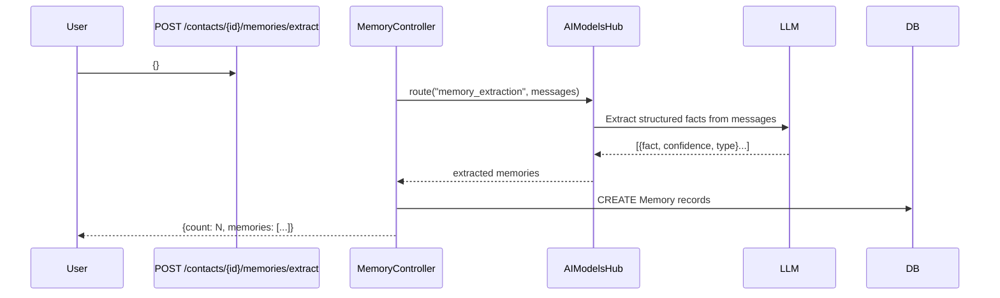

# Memory Hub — Architecture

## 1. Overview

The Memory Hub manages **structured, versioned, confidence-scored memories** that give Nexus's AI agents persistent context about contacts, events, and system state. It integrates with the Contacts Hub (contact-specific memories) and the Hedra Soul Hub (AI self-knowledge).

---

## 2. Architecture Diagram



---

## 3. Memory Confidence Model



- **Confidence** is a float between 0.0 and 1.0
- **Reinforcement** (`POST /memories/{id}/reinforce`) increases confidence
- **Decay** (`POST /memories/decay`) reduces confidence for all memories older than N days
- **Stale** memories have low confidence AND are old — surfaced via `/contacts/{id}/stale-memory`

---

## 4. Memory Versioning

Every update to a memory creates a `ContactMemoryVersion` record with the previous value. This enables rollback to any historical state of a memory.

---

## 5. AI Memory Extraction



---

## 6. Key Models

### `Memory`
```
Fields: id, contact_id, content(text), confidence(decimal),
        type, source, extraction_method, is_indexed,
        extracted_at, reinforced_at, created_at, updated_at

Relationships:
  - belongsTo: Contact
  - hasMany: ContactMemoryVersion
```

### `ContactMemoryVersion`
```
Fields: id, memory_id, previous_content, changed_at, changed_by_user_id
```

---

## 7. Mem0 Integration (Stub)

The `Mem0Integration` class provides the interface for external semantic memory storage, but is currently a stub. Once wired:
- `store(userId, content, metadata)` — Upserts a memory to the Mem0 cloud
- `search(userId, query)` — Semantic similarity search across stored memories
- `delete(memoryId)` — Removes a memory from Mem0

**Config (.env):**
```env
MEM0_API_KEY=your-key
MEM0_BASE_URL=https://api.mem0.ai
```
