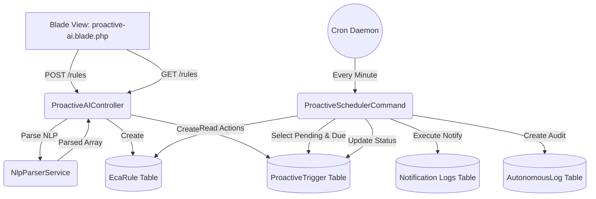

# Proactive AI Hub: Technical Architecture

## 1. Architectural Overview
The Proactive AI Hub follows a typical MVC (Model-View-Controller) pattern inherent to the Laravel framework, but it is augmented by a robust background processing layer. The architecture is designed to decouple the creation of rules from their execution, ensuring high performance and non-blocking user interactions.

## 2. Core Components

### 2.1 The Controller Layer
`ProactiveAIController` serves as the entry point for API requests originating from the Blade views. It handles:
- **Validation:** Ensuring incoming rule requests are structurally sound.
- **Delegation:** Passing natural language strings to the `NlpParserService`.
- **Persistence:** Storing the resulting `EcaRule` and immediate `ProactiveTrigger` records.

### 2.2 The Service Layer
`NlpParserService` acts as the domain logic container for rule parsing. It isolates the complexity of string manipulation, regex matching, and temporal calculations (using `Carbon`) from the controller. This adherence to the Single Responsibility Principle ensures that as the NLP logic grows (perhaps eventually calling an external LLM API), the controller remains untouched.

### 2.3 The Data Layer (Models)
- **EcaRule:** Represents the abstract rule. Contains the raw `natural_language_rule`, and the parsed `event_type`, `conditions`, and `actions` (stored as JSON/array casts).
- **ProactiveTrigger:** Represents a concrete instance of an action waiting to happen. Linked to an `EcaRule`. Uses `status` to track execution state (`pending`, `completed`, `failed`).
- **AutonomousLog:** An append-only audit log detailing what the system did and why.

### 2.4 The Execution Layer (Console Command)
`ProactiveSchedulerCommand` (`proactive:run-scheduler`) is the heartbeat of the Hub. It is designed to be run via the Laravel Task Scheduler (e.g., every minute). It queries the database for ripe triggers, executes the defined actions, and records the outcome.

## 3. Mermaid Architecture Diagram

## 4. Detailed Component Analysis

### 4.1 Database Design Choices
The use of JSON columns (`conditions` and `actions` in `EcaRule`, `context_payload` in `ProactiveTrigger`) is a deliberate architectural choice. Because an ECA rule can dictate a vast array of actions (sending emails, restarting servers, making HTTP requests), a rigidly normalized schema would require dozens of pivot tables. JSON columns allow for arbitrary payload structures, providing extreme flexibility at the cost of some query performance (which is acceptable here as we primarily query triggers by `status` and `next_run_at`, not by payload contents).

### 4.2 Error Handling & Resilience
In `ProactiveSchedulerCommand`, the iteration over triggers is wrapped in a `try/catch` block. If an individual trigger throws an exception (e.g., a notification service is down), the catch block logs the error and updates *only that trigger* to a `failed` status. The loop then continues to the next trigger. This is critical for preventing a single bad rule from jamming the entire automation queue.

### 4.3 Extensibility
The `event_type` parsing in `NlpParserService` currently defaults to `ContactMessageReceived`. The architecture is designed so that future developers can easily add new listeners for other system events (e.g., `CpuSpikeDetected`). These events would query active `EcaRule` records where `event_type` matches, evaluate the `conditions`, and then either execute immediately or create a `ProactiveTrigger`.
