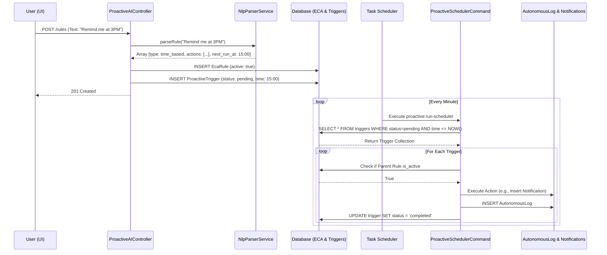

# Proactive AI Hub: Data Flow

## 1. Data Flow Description
The data flow within the Proactive AI Hub describes how unstructured user input (natural language) is transformed into structured, actionable database records, and eventually translated into real-world system effects. The flow is distinctly split into two phases: the **Definition Phase** (synchronous, user-driven) and the **Execution Phase** (asynchronous, system-driven).

### 1.1 The Definition Phase (Rule Creation)
1. **Input:** The user types a sentence into the Blade UI modal.
2. **Request:** A POST request containing the `natural_language_rule` is sent to `ProactiveAIController@storeRule`.
3. **Validation:** The controller validates the string length and basic constraints.
4. **Parsing:** The string is passed to `NlpParserService->parseRule()`.
5. **Transformation:** 
    - The NLP engine identifies temporal markers to set a `next_run_at` timestamp.
    - It identifies action markers (e.g., "notify") to build an `actions` array.
    - It maps the intent to an `event_type`.
6. **Persistence (Rule):** The controller creates a new `EcaRule` record, storing the parsed JSON structures.
7. **Persistence (Trigger):** If a `next_run_at` time was determined, a `ProactiveTrigger` record is immediately created, inheriting the actions as its `context_payload`, with a status of `pending`.
8. **Response:** A JSON success response is sent back to the UI.

### 1.2 The Execution Phase (Scheduler Loop)
1. **Invocation:** The Laravel scheduler triggers `ProactiveSchedulerCommand` every minute.
2. **Query:** The command queries the database for `ProactiveTrigger` records where `status = 'pending'` AND `next_run_at <= Carbon::now()`.
3. **Iteration:** For each fetched trigger, the system loops through its execution logic.
4. **Validation:** It fetches the parent `EcaRule` to ensure `is_active` is true. If false, the trigger is skipped.
5. **Action Routing:** The command parses the `actions` JSON. If it contains a `notify` key, it executes the notification branch (inserting a record into `notification_logs`).
6. **Audit Logging:** An `AutonomousLog` record is inserted detailing the action taken.
7. **Status Update:** The trigger's status is updated to `completed` (or `failed` if an exception was caught during action routing).

## 2. Mermaid Data Flow Diagram



## 3. Data Payloads

### 3.1 NlpParserService Output Array
This is the critical internal data structure bridging the NLP service and the database:
```json
{
  "type": "time_based",
  "conditions": [],
  "actions": {
    "notify": {
      "message": "Scheduled Reminder from AI Assistant",
      "recipient": "Hedra"
    }
  },
  "next_run_at": "2026-07-02 15:00:00",
  "event_type": null
}
```

### 3.2 Trigger Execution Flow Considerations
Data integrity is maintained during execution via status flags. A trigger goes from `pending` -> `completed` or `failed`. Because triggers are evaluated based on `next_run_at <= Carbon::now()`, a temporary failure of the scheduler daemon will simply result in triggers being executed late during the next successful run, rather than being missed entirely.
