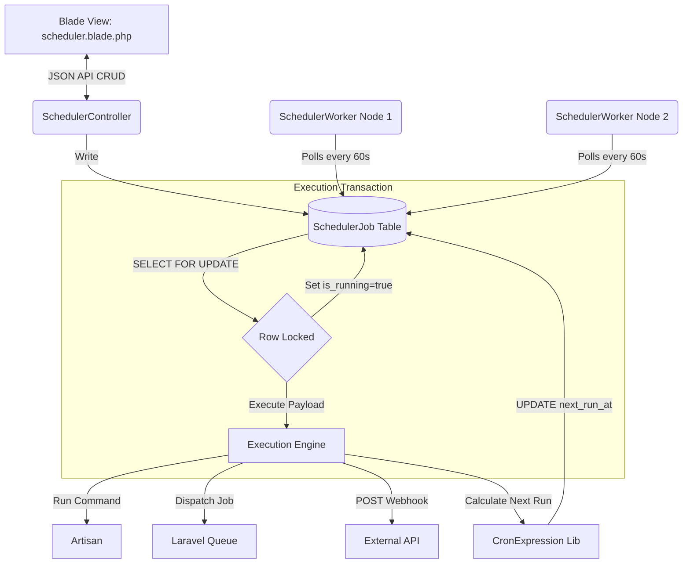

# Scheduler Hub: Technical Architecture

## 1. Architectural Overview
The Scheduler Hub employs a robust, database-driven orchestration architecture. It relies on a long-running daemon process (the worker) that continuously polls a central database to coordinate task execution. This pattern is designed specifically to solve the problems of multi-server concurrency and dynamic schedule management.

## 2. Core Components

### 2.1 The Data Layer (`SchedulerJob` Model)
The `SchedulerJob` model represents the single source of truth for a task. Key structural choices include:
- **`cron_expression`:** Stores standard Unix cron strings (e.g., `0 * * * *`).
- **`status`:** An enum (`active`, `paused`, `failing`) controlling whether the job should be considered for execution.
- **`is_running`:** A critical boolean flag used as a secondary safety mechanism during execution.
- **`last_run_at` & `next_run_at`:** Cache columns. Instead of recalculating the cron expression for every row on every poll, the system pre-calculates `next_run_at`. The worker simply queries `next_run_at <= NOW()`.

### 2.2 The REST API (`SchedulerController`)
A standard, thin controller providing JSON responses for CRUD operations. It utilizes Laravel's `request->validate()` to ensure data integrity (e.g., ensuring `type` is restricted to `command, job, webhook, script`).

### 2.3 The Execution Daemon (`SchedulerWorker`)
This is a Laravel Artisan command designed to run as a continuous loop (`while(true)`). 
- **Daemon Mode:** Using the `--daemon` flag, it sleeps for 60 seconds between polling cycles, perfectly aligning with the minimum resolution of standard cron.
- **The Polling Cycle:** Located in `processDueJobs()`.
- **Cron Parsing:** Utilizes the `Cron\CronExpression` package to parse the cron string and calculate the subsequent `next_run_at` timestamp.

## 3. Concurrency & Locking Strategy
The most sophisticated part of the architecture is how it handles concurrency.
- **The Problem:** If two servers are running the `scheduler:worker` command simultaneously, they might both query the database at exactly `12:00:00`, see the same job is due, and both execute it.
- **The Solution:** The architecture uses `DB::transaction()` combined with `lockForUpdate()`. 
- **How it works:** When Worker A begins its transaction, the `SELECT ... FOR UPDATE` query asks the database to physically lock the rows it reads. When Worker B attempts the exact same query a millisecond later, the database forces Worker B to wait until Worker A finishes its transaction. Worker A immediately sets `is_running = true` and saves the model, committing the transaction and releasing the database lock. When Worker B is finally allowed to read the rows, it sees `is_running = true` and skips the job.

## 4. Mermaid Architecture Diagram

## 5. Extensibility: The Execution Payload
The `payload` column is defined as JSON (`array` cast). This architectural choice allows different job `types` to store varying configurations without schema changes:
- If `type = 'command'`, payload might be: `{"command": "app:sync-waha", "args": ["--force"]}`
- If `type = 'webhook'`, payload might be: `{"url": "https://api.example.com", "method": "POST", "headers": {"Auth": "Token"}}`
This polymorphism is central to the Hub's flexibility.

## 6. Fault Tolerance Design
The worker wraps the execution of each individual job in a `try/catch` block. If a job fails unexpectedly:
1. The error message is retrieved.
2. `is_running` is reset to `false` (crucial to prevent the job from becoming permanently locked/zombied).
3. `status` is set to `failing`.
This ensures that one broken webhook does not crash the entire scheduling daemon.
