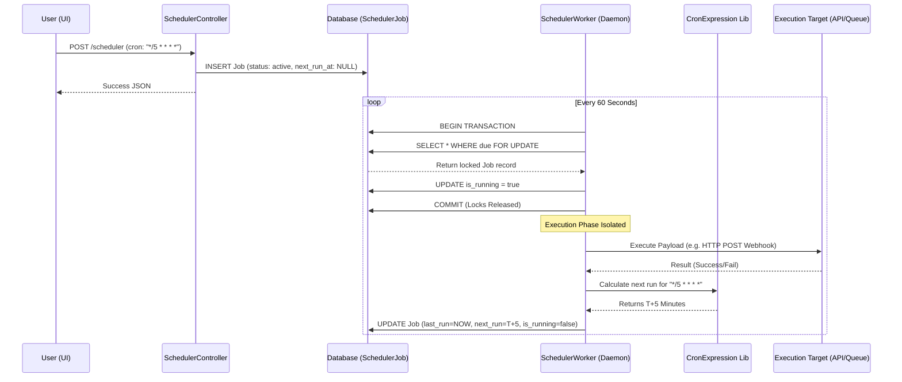

# Scheduler Hub: Data Flow

## 1. Data Flow Description
The Scheduler Hub manages two primary data flows: the **Configuration Flow** (managed via the UI and REST API) and the **Execution Flow** (managed continuously by the daemon worker).

### 1.1 Configuration Flow (CRUD)
1. **User Action:** The user fills out the "New Job" modal and clicks Save.
2. **Request:** A POST request containing JSON data (`name`, `type`, `cron_expression`, `payload`) is sent to `SchedulerController@store`.
3. **Validation:** The controller validates the data types and ensures the `type` is one of the allowed enums.
4. **Database Write:** A new `SchedulerJob` record is created. The `is_running` flag defaults to `false`. The `status` defaults to `active`.
5. **Response:** The newly created job is returned as JSON.
6. **UI Update:** The frontend JS dynamically renders a new job card without reloading the page.

### 1.2 Execution Flow (The Worker Daemon)
This is a continuous loop that dictates how the system evaluates time and triggers actions.
1. **Daemon Tick:** Every 60 seconds, the `scheduler:worker` executes `processDueJobs()`.
2. **Transaction Start:** A database transaction is initiated.
3. **Query & Lock:** The worker queries: `SELECT * FROM scheduler_jobs WHERE status='active' AND is_running=false AND (next_run_at <= NOW() OR next_run_at IS NULL) FOR UPDATE`. This grabs the rows and locks them from other processes.
4. **Claiming:** For every returned job, the worker sets `is_running = true` and issues an `UPDATE` query.
5. **Transaction End:** The database transaction commits, releasing the locks. Other workers can now read the table, but they will ignore these jobs because `is_running` is now true.
6. **Payload Execution:** The worker evaluates the job `type`.
    - If `command`: it parses the `payload` array and uses `Artisan::call()`.
    - If `webhook`: it parses the `payload` URL and uses Laravel's `Http` client to dispatch a POST request.
7. **Cron Calculation:** The worker instantiates a new `CronExpression` object using the job's cron string. It calculates the exact datetime for the *next* execution (`$cron->getNextRunDate($now)`).
8. **Final State Update:** The worker updates the job record: `last_run_at = NOW()`, `next_run_at = [Calculated Time]`, and importantly, resets `is_running = false`.
9. **Sleep:** The worker goes back to sleep until the next 60-second interval.

## 2. Mermaid Data Flow Diagram

## 3. Data Integrity & Race Conditions
The separation of the transaction block from the execution block is a critical data flow requirement.
- The transaction *only* covers the act of querying, locking, and setting `is_running = true`.
- It does *not* cover the actual execution of the webhook or command.
- If the transaction was held open during execution, a slow webhook (e.g., 30 seconds) would lock the entire table, causing the scheduler to freeze and miss other jobs.
- By setting the flag and releasing the lock immediately, the worker achieves concurrent, non-blocking execution while maintaining perfect atomic safety.
