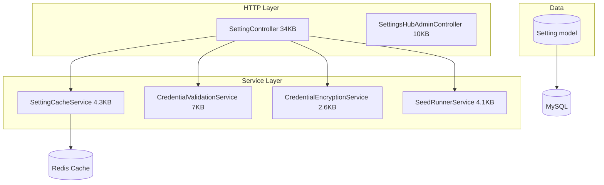

# Settings Hub — Architecture

## 1. Overview

The Settings Hub manages all application configuration — from API keys to feature flags, UI preferences, and system operational modes. It is a critical control plane for the Nexus platform.

---

## 2. Key Features

| Feature | Description |
|---|---|
| Grouped settings | Settings organized by `category` + `subcategory` |
| Encrypted settings | API keys stored with AES-256 encryption |
| Bulk update | Update multiple settings in one request |
| Factory reset | Restore all settings to seed defaults |
| Credential validation | Test any API key/credential on demand |
| Seed runner | Run specific database seeders from the UI |
| Global agent pause | Emergency kill switch — halts all AI agents |
| Maintenance mode | Toggle site maintenance |
| API proxy | Route settings-driven API calls through the backend |

---

## 3. Architecture Diagram



---

## 4. Setting Model Structure

```
Fields: id, key, value, encrypted_value, is_encrypted, type,
        category, subcategory, description, is_public, workspace_id

Category Examples:
  - ai_providers: AI API keys
  - system: Core system settings
  - notifications: Email / Slack keys
  - features: Feature flags
  - ui: UI preferences
```

---

## 5. Security Architecture

### Encrypted Settings
When a setting with `is_encrypted = true` is stored:
1. `CredentialEncryptionService` encrypts the value using AES-256
2. The result is stored in `encrypted_value`; `value` is left null
3. On read, the service decrypts on demand
4. API responses NEVER return the raw decrypted key — only a masked version

### Authorization
- `POST /settings/system/agent-pause` → requires `can:toggleEmergency,Setting`
- `POST /settings/seeds/{id}/run` → requires `can:runSeeder,Setting`
- Admin dashboard routes → requires `can:create,Setting`

---

## 6. Key Services

### `SettingCacheService` (4.3KB)
- Caches all settings in Redis with a configurable TTL
- `get(key, default)` — Returns cached or fresh value
- `set(key, value)` — Updates setting + busts cache
- `flush()` — Clears entire settings cache
- `getGrouped()` — Returns settings grouped by category for the UI

### `CredentialValidationService` (7KB)
- Validates credentials against their respective services
- Handles: OpenAI keys, Anthropic keys, WAHA keys, SMTP, Redis, database
- Returns `{valid: bool, message: string, latency_ms: int}`

### `SeedRunnerService` (4.1KB)
- Lists available seeder classes
- Executes a specific seeder by ID
- Supports running multiple seeders
- Logs each seed run outcome

---

## 7. Emergency Controls

### Global Agent Pause
`POST /api/v1/settings/system/agent-pause`  
Sets `nexus.agent_pause = true` in settings. All agent job handlers check this flag at startup and exit early if set.

### Maintenance Mode
`POST /api/v1/settings/system/maintenance-mode`  
Triggers Laravel's built-in maintenance mode toggle (`php artisan down`/`up` equivalent via Artisan call).
