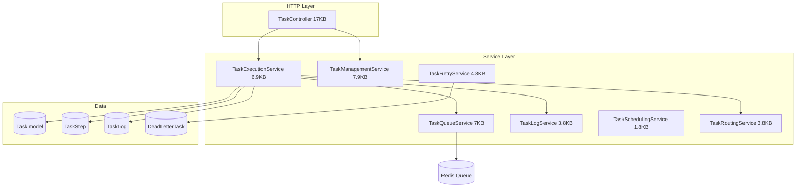
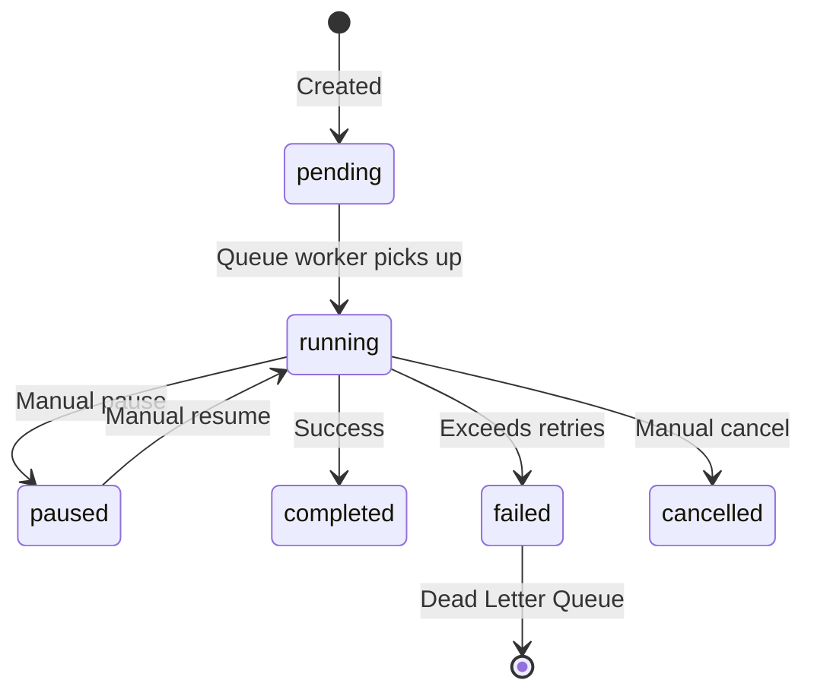

# Tasks Hub — Architecture

## 1. Overview

The Tasks Hub provides a **heterogeneous task management system** that supports three distinct task types: Manual (user-initiated), Agent (AI-driven), and System (internal automation). It includes full lifecycle management, queue-backed execution, logging, and retry mechanisms.

---

## 2. Architecture Diagram



---

## 3. Task Types & Creation Endpoints

| Type | Creation Endpoint | Description |
|---|---|---|
| `manual` | `POST /api/v1/tasks/manual` | User explicitly creates and potentially runs |
| `agent` | `POST /api/v1/tasks/agent` | Dispatched by an Agent during execution |
| `system` | `POST /api/v1/tasks/system` | Created by system events or scheduled jobs |

---

## 4. Task Status Lifecycle



---

## 5. Key Services

### `TaskExecutionService` (6.9KB)
Main execution engine:
- `execute(task)` — Validates task, updates status to `running`, delegates to type-specific executor, logs result

### `TaskManagementService` (7.9KB)
High-level management operations:
- `createManualTask()`, `createAgentTask()`, `createSystemTask()`
- `pause()`, `resume()`, `cancel()`
- `updateStatus()`

### `TaskQueueService` (7KB)
Manages the Redis queue:
- `enqueue(task)` — Pushes task to the appropriate queue
- `dequeue()` — Pulls and locks next task
- `getQueueStats()` — Returns depth, throughput, failed count per queue

### `TaskRetryService` (4.8KB)
Retry logic:
- Tracks `retry_count` vs `max_retries` per task
- On max retries exceeded, moves task to `DeadLetterTask`
- `DeadLetterQueueService` handles DLQ inspection and bulk-retry

### `TaskRoutingService` (3.8KB)
Routes tasks to the correct queue/worker based on task type, priority, and resource requirements.

### `TaskLogService` (3.8KB)
Records step-by-step execution logs:
- `logStep(task, step_name, output, status)`
- Each step is stored as a `TaskLog` and `TaskStep` record

---

## 6. Key Models

### `Task`
```
Fields: id, title, type, status, priority, payload(json), result(json),
        assigned_agent_id, owner_id, started_at, completed_at,
        retry_count, max_retries, tags(json)
```

### `TaskStep`
```
Fields: id, task_id, name, status, output(json), started_at, completed_at
```

### `TaskLog`
```
Fields: id, task_id, message, level, context(json), logged_at
```

### `DeadLetterTask`
```
Fields: id, task_id, reason, payload(json), failed_at, retry_attempts
```
