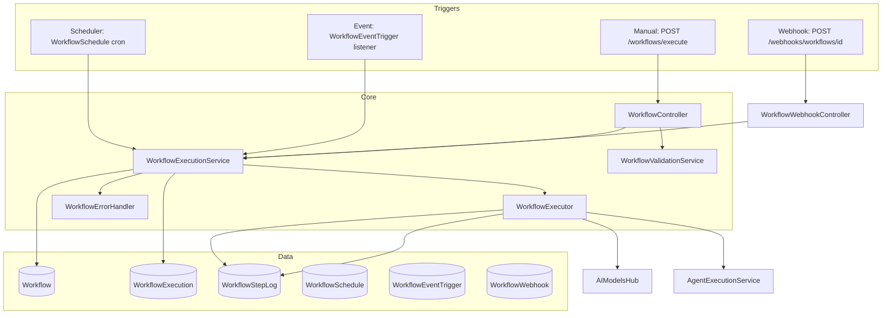
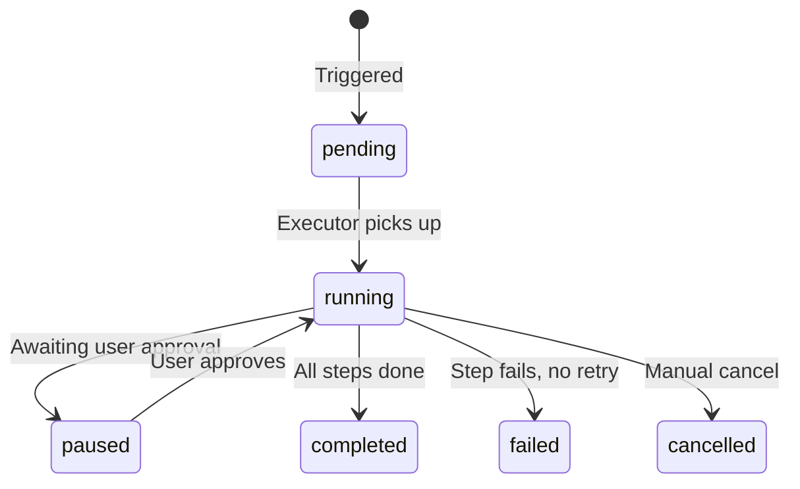

# Workflows Hub — Architecture

## 1. Overview

The Workflows Hub is the **automation engine** of Nexus. It enables the creation of multi-step workflows that can be triggered manually, via schedule, via events, or via webhooks. Each workflow execution is tracked step-by-step in real time.

---

## 2. Architecture Diagram



---

## 3. Workflow Step Execution Model

A Workflow's `steps` field is a JSON array of step definitions. Each step has a `type` that determines what the executor does.

```json
{
  "steps": [
    {
      "id": "step_1",
      "type": "ai_completion",
      "config": { "intent": "contact_analysis", "input": "{{trigger.contact_id}}" }
    },
    {
      "id": "step_2",
      "type": "run_agent",
      "config": { "agent_key": "memory_updater", "depends_on": "step_1" }
    },
    {
      "id": "step_3",
      "type": "send_notification",
      "config": { "channel": "email", "template_id": 5 }
    }
  ]
}
```

---

## 4. Execution Lifecycle



---

## 5. Key Services

### `WorkflowExecutionService` (3KB)
Creates `WorkflowExecution` records, validates the workflow, dispatches the execution job.

### `WorkflowExecutor` (2.1KB)
Iterates through workflow steps, delegating each step to the correct engine (AI, Agent, Notification, HTTP call, etc.).

### `WorkflowValidationService` (3.2KB)
Pre-flight validation before execution — checks required fields, step dependencies, circular references.

### `WorkflowErrorHandler` (5.3KB)
Handles step failures: retries, fallback steps, and dead-letter routing.

---

## 6. Trigger Types

| Type | Model | How it Works |
|---|---|---|
| Manual | N/A | `POST /api/v1/workflows/{id}/execute` |
| Scheduled | `WorkflowSchedule` | Cron expression stored in DB, evaluated by scheduler |
| Event-based | `WorkflowEventTrigger` | Laravel event listener maps events to workflow IDs |
| Webhook | `WorkflowWebhook` | Unique URL per workflow, `POST /api/v1/webhooks/workflows/{id}` |
